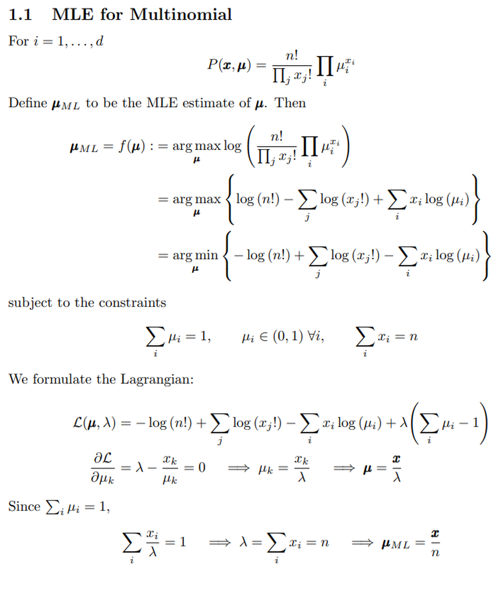
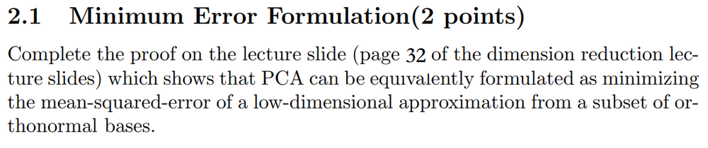
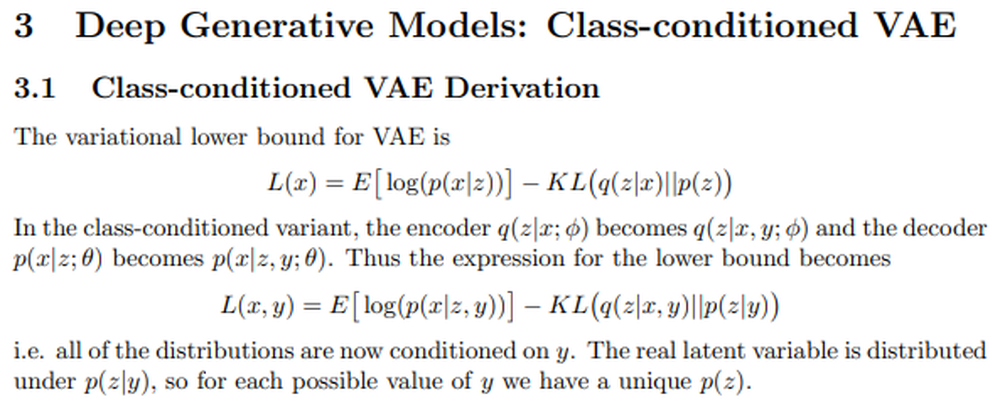

# Class-Conditioned-VAE
Deep Generative Models: Class-conditioned Variational Autoencoder (VAE) for generating MNIST digits.

## 1.2 EM for mixture of multinomials (1 point)

Consider the following mixture-of-multinomials model to analyze a corpus of documents that are represented in the bag-of-words model. Specifically, assume we have a corpus of D documents and a vocabulary of W words from which every word in the corpus is token. We are interested in counting 

### Requirements
    1. Following the variational Bayes algorithm of the original VAE, derive the algorithm for this class-conditioned variant (2 points). Hint: You need to design the variational distribution and write down the variational lower bound.
    2. Implement the algorithm with ZhuSuan, and train the model on the whole training set of MNIST (2 points). Then, visualize generations of your learned model. Set y observed as {1, 2, ··· , K}, and generate multiple xs for each y using your learned model (1 point).

